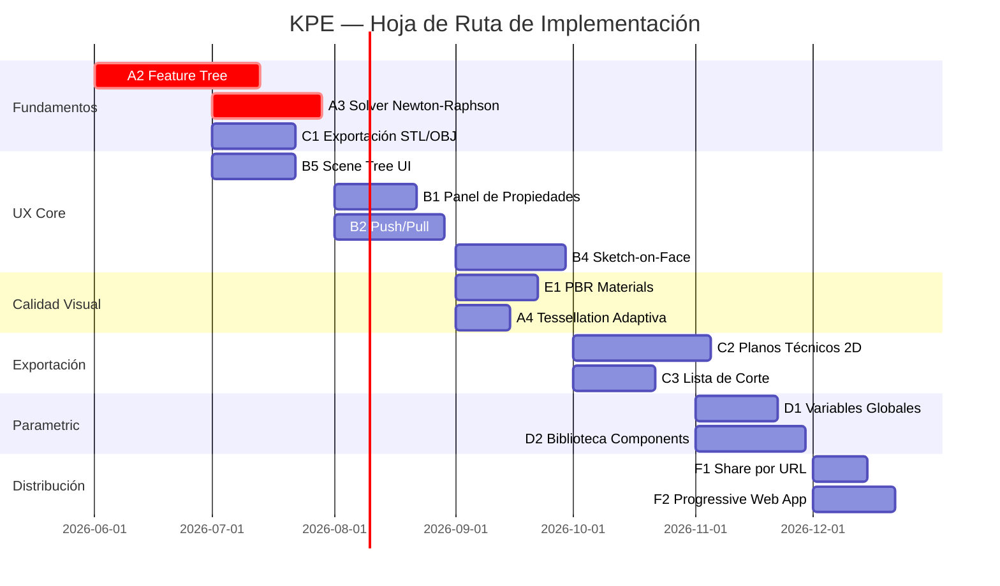

# KPE — Visión de Mejoras para Superar a FreeCAD

> **Fecha:** 2026-05-27  
> **Autor:** KPE Project  
> **Propósito:** Análisis profundo del estado actual del engine y propuesta de mejoras concretas, organizadas por impacto y dificultad, con el objetivo de hacer que KPE sea sustancialmente más fácil de usar y más poderoso que FreeCAD para diseño 3D paramétrico.

---

## 1. Diagnóstico Honesto del Estado Actual

Antes de proponer mejoras hay que tener claro dónde estamos y qué gaps existen frente a FreeCAD.

| Capacidad | FreeCAD | KPE Hoy | Gap |
|---|---|---|---|
| Sketch 2D con constraints | ✅ Robusto | ⚠️ Alpha (solver gradient-descent básico) | Alto |
| Extrusión paramétrica | ✅ | ✅ Funcional | Bajo |
| Revolve / Sweep / Loft | ✅ | ⚠️ Sweep/Revolve en schema, loft ausente | Medio |
| CSG Booleanos | ✅ OpenCASCADE | ⚠️ csgrs (BSP, calidad variable) | Alto |
| Árbol de features (history) | ✅ | ❌ No existe | Crítico |
| Assembly (ensamblado de piezas) | ✅ | ❌ Esqueleto solo en joint.rs | Alto |
| Exportación STL/STEP/OBJ | ✅ | ❌ Sin implementar | Alto |
| Fillet / Chamfer 3D real | ✅ | ❌ | Alto |
| UI / UX | ⚠️ Difícil, anticuada | ⚠️ Moderna pero incompleta | — |
| Curva de aprendizaje | ❌ Empinada | ⚠️ En definición | Oportunidad |
| Web / multiplataforma | ❌ Solo desktop | ✅ WASM nativo | Ventaja KPE |
| Scripting / API | ✅ Python | ❌ | Medio |

**Veredicto:** FreeCAD gana en robustez geométrica. KPE gana en arquitectura
moderna, web-first, y potencial de UX. La brecha más crítica está en tres áreas:
el **árbol de historial de features**, la **calidad del CSG**, y la **experiencia
de usuario del sketch 2D**.

---

## 2. Mejoras Propuestas — Organizadas por Impacto

### ÁREA A — Fundamentos Geométricos (sin esto nada funciona bien)

#### A1. Reemplazar csgrs por un kernel CSG robusto basado en `manifold` vía bindings seguros

**Problema actual:** `csgrs` usa un árbol BSP que produce artefactos en
geometrías de alta complejidad (Z-fighting, caras invertidas, huecos). Las últimas
tres conversaciones de debug fueron exactamente sobre esto.

**Propuesta:**
- Integrar [Manifold](https://github.com/elalish/manifold) (la librería que usa
  Blender 3.6+ para sus booleanos) a través de un thin C wrapper generado con
  `cc` crate, manteniendo el principio de "Rust como núcleo".
- El wrapper expone solo 4 funciones: `manifold_union`, `manifold_difference`,
  `manifold_intersection`, `manifold_to_mesh`.
- `CsgKernel` en `kpe-geometry/src/csg.rs` redirige a estas funciones cuando
  están disponibles, con fallback a csgrs para WASM (Manifold tiene compilación
  WASM propia).
- **Resultado esperado:** booleanos perfectos, sin artefactos, sobre geometría
  real de muebles con cientos de miles de triángulos.

```
crates/
  kpe-manifold/         ← nuevo crate wrapper
    build.rs            ← compila manifold con cc
    src/
      lib.rs            ← bindings seguros a las 4 funciones
      fallback.rs       ← csgrs como fallback WASM
```

#### A2. Árbol de Historial de Features (Feature Tree / B-Rep History)

**Este es el cambio más importante de todos.**

**Problema actual:** KPE trabaja con mallas trianguladas (`TriangleMesh`). Una
vez que extruyes o haces un booleano, el resultado es solo triángulos — no hay
historia. Si cambias un parámetro, tienes que recalcular todo desde cero sin
saber qué causó qué.

**Propuesta:** Introducir un `FeatureTree` en `kpe-schema`:

```rust
// kpe-schema/src/feature_tree.rs
pub struct FeatureTree {
    pub nodes: Vec<FeatureNode>,
    pub root: NodeId,
}

pub enum FeatureNode {
    Sketch    { id: NodeId, def: SketchDef },
    Extrude   { id: NodeId, sketch: NodeId, params: ExtrudeDef },
    Revolve   { id: NodeId, sketch: NodeId, params: RevolveDef },
    Sweep     { id: NodeId, profile: NodeId, path: NodeId, params: SweepDef },
    BoolUnion { id: NodeId, base: NodeId, tool: NodeId },
    BoolCut   { id: NodeId, base: NodeId, tool: NodeId },
    Fillet    { id: NodeId, base: NodeId, edges: Vec<EdgeId>, radius: f64 },
    Mirror    { id: NodeId, base: NodeId, plane: MirrorPlane },
    Pattern   { id: NodeId, base: NodeId, params: PatternDef },
    Component { id: NodeId, children: Vec<NodeId> },
}
```

El evaluador del árbol (en `kpe-geometry`) recorre el árbol de arriba a abajo,
evalúa cada nodo, y produce el `TriangleMesh` final. Cuando un parámetro cambia,
solo se re-evalúa el subárbol afectado (memoization por hash de parámetros).

**Impacto:** esto convierte KPE de "un render 3D" a un "CAD engine real".

#### A3. Solver de Constraints 2D de Clase Profesional

**Problema actual:** el solver de `kpe-geometry/src/sketch/` usa gradient-descent,
que diverge en sistemas con constraints cíclicas o sobredeterminados.

**Propuesta:** Implementar un solver basado en **Newton-Raphson con pivoteo
parcial** (el mismo enfoque que SolveSpace y FreeCAD Sketcher):

```rust
// kpe-geometry/src/sketch/solver_nr.rs
pub struct NewtonRaphsonSolver {
    max_iter: usize,       // 50 iteraciones típicamente suficiente
    tolerance: f64,        // 1e-10
    damp_factor: f64,      // 0.7 para convergencia en sistemas mal condicionados
}
```

- Construir la **matriz Jacobiana** del sistema de constraints.
- Resolver con eliminación Gaussiana o descomposición LU (con `nalgebra`).
- Detectar sistemas sobredeterminados (rango < DOF) y reportar al usuario
  exactamente qué constraint está en conflicto.
- Soporte para **constraints de referencia** (driven dimensions) que no
  participan en el solve pero se actualizan como output.

**Resultado:** convergencia en geometrías complejas (polígonos con muchos
ángulos iguales, círculos tangentes, etc.) que hoy hacen divergir al solver.

#### A4. Tessellation Adaptativa — Meshes de calidad variable según zoom

**Problema actual:** todos los objetos se tesselan con un número fijo de
segmentos (32 para círculos). Geometría simple se ve blocky; geometría compleja
con muchos segmentos mata el performance.

**Propuesta:** LOD (Level of Detail) automático basado en distancia de cámara:

```rust
pub struct TessellationParams {
    pub chord_tolerance: f64,    // máx desviación del arco real (ej: 0.01 mm)
    pub angle_tolerance: f64,    // ángulo entre normales consecutivas (ej: 5°)
    pub max_segments: u32,       // límite superior por arco (ej: 256)
    pub min_segments: u32,       // límite inferior (ej: 8)
}
```

Esto produce círculos de 8 segmentos cuando están lejos y 128 cuando están
cerca, sin cambiar la definición paramétrica.

---

### ÁREA B — UX que hace la diferencia vs FreeCAD

#### B1. Panel de Propiedades en Tiempo Real con Edición Directa

**Problema actual:** cambiar un parámetro requiere editar JSON o reescribir el sketch.

**Propuesta:** Un panel lateral (React) que muestra todas las propiedades del
objeto seleccionado como inputs editables:

```
┌─────────────────────────────┐
│ ▼ Extrude_001               │
│   Distancia:  [  45.00 mm ] │
│   Dirección:  Z ▾           │
│   Cap:        [✓]           │
├─────────────────────────────┤
│ ▼ Sketch_001 (referencia)   │
│   Ancho:      [  120.0 mm ] │
│   Alto:       [   80.0 mm ] │
└─────────────────────────────┘
```

- Cada campo dispara una re-evaluación del `FeatureTree` (A2) con el nuevo valor.
- Animación de transición del mesh mientras el usuario arrastra un slider.
- Atajos numéricos: escribir `120` en el campo de distancia y presionar Enter.

#### B2. Herramienta Push/Pull al Estilo SketchUp

**Esta es la herramienta que hace a SketchUp tan fácil de usar.**

El usuario hace hover sobre una cara de un sólido y arrastra para extruirla o
empujarla. No necesita saber qué es un sketch ni una extrusión.

```rust
// kpe-geometry/src/push_pull.rs (el archivo ya existe!)
pub fn push_pull_face(
    mesh: &TriangleMesh,
    face_index: usize,
    distance: f64
) -> TriangleMesh
```

El archivo `push_pull.rs` ya existe en `kpe-geometry/src/` pero está
sub-desarrollado (2.6 KB). Expandirlo para:
1. Detectar la cara bajo el cursor (ray casting en Three.js).
2. Identificar el grupo de caras coplanares adyacentes.
3. Extruir ese grupo en la dirección de la normal.
4. Crear automáticamente un feature `PushPull` en el `FeatureTree`.

#### B3. Snap Inteligente 3D con Inferencia de Plano

**Problema actual:** el snap existe en el sketch 2D pero no en el viewport 3D.

**Propuesta:** Al mover o crear geometría en 3D:
- Snap a vértices de la malla existente (highlight amarillo).
- Snap a aristas (highlight azul).
- Snap a centros de caras (highlight verde).
- **Inferencia de plano:** si el usuario mueve el cursor cerca de una cara,
  el sistema detecta el plano y ofrece operaciones en ese plano (como crear
  un nuevo sketch sobre esa cara).
- Líneas de "guía" punteadas que muestran la relación de alineación con otros objetos.

#### B4. Modo Sketch-on-Face — Crear sketches directamente sobre caras 3D

**Problema actual:** los sketches solo viven en los planos XY/XZ/YZ. Para hacer
un agujero en una cara inclinada, hay que hacer malabares con transformaciones.

**Propuesta:**
1. Usuario hace clic derecho sobre una cara 3D → "Crear Sketch en esta cara".
2. KPE calcula el plano local de esa cara (normal + centroide).
3. Se abre el editor 2D en el sistema de coordenadas de esa cara.
4. El usuario dibuja el perfil (ej: un círculo para un agujero).
5. Se genera un `Extrude` o `BoolCut` automáticamente en el `FeatureTree`.

```rust
// kpe-schema/src/geometry.rs
pub enum SketchPlane {
    XY, XZ, YZ,
    // NUEVO:
    FacePlane {
        origin: [f64; 3],
        normal: [f64; 3],
        x_axis: [f64; 3],  // define la orientación
    }
}
```

#### B5. Árbol de Objetos Visual (Scene/Feature Tree en la UI)

**FreeCAD tiene esto; es fundamental para proyectos complejos.**

Un panel lateral izquierdo con la jerarquía de objetos:

```
▼ 📦 Silla_001
  ▼ 📦 Pata_Delantera_Izq
    📐 Sketch_Base
    📦 Extrude_001 (h: 75cm)
    ✂️  Fillet_001 (r: 2mm)
  ▼ 📦 Pata_Delantera_Der
    🔗 Espejo de Pata_Delantera_Izq
  ▼ 📦 Asiento
    ...
```

- Click en nodo → selecciona el objeto en el viewport.
- Doble-click → abre el modo edición de ese feature.
- Arrastrar nodos → reordena el árbol de evaluación.
- Visibility icon (👁) → oculta/muestra el objeto.
- Bloquear icon (🔒) → congela el feature (no re-evalúa).

#### B6. Dimensionado Automático con Cotas Visuales

Cuando el usuario selecciona dos puntos, aristas, o caras, KPE muestra automáticamente:
- Distancia entre ellos (con flecha de cota estilo plano técnico).
- Ángulo entre aristas/caras.
- Radio de arco seleccionado.

Si el usuario hace clic en la cota → se convierte en un constraint paramétrico
(una dimensión "driven" que bloquea ese valor).

---

### ÁREA C — Exportación y Fabricación (lo que hace el producto útil en la realidad)

#### C1. Pipeline de Exportación Completo

Actualmente ningún formato de exportación está implementado. Esto es bloqueante
para cualquier uso real.

**Prioridad de implementación:**

| Formato | Uso | Dificultad | Impl en |
|---|---|---|---|
| STL (binario) | Impresión 3D | Baja | `kpe-fabrication` |
| OBJ + MTL | Renders, Blender | Baja | `kpe-fabrication` |
| DXF 2D | CNC Router, corte láser | Media | `kpe-fabrication` (base existe) |
| SVG 2D | Corte láser, planos | Media | `kpe-fabrication` |
| 3MF | Impresión profesional | Media | `kpe-fabrication` |
| GLTF/GLB | Web, AR/VR | Media-Alta | apps/web |
| STEP | Intercambio CAD | Alta | `kpe-cli/src/export/step.rs` (esqueleto) |
| PDF técnico | Planos de construcción | Alta | futura |

**Arquitectura propuesta:**

```rust
// kpe-fabrication/src/export/mod.rs
pub trait Exporter {
    fn export(mesh: &TriangleMesh, opts: &ExportOptions) -> Vec<u8>;
}

pub use stl::StlExporter;
pub use obj::ObjExporter;
pub use gltf::GltfExporter;
```

El WASM expone `kpe_export(mesh_json, format_str) -> Vec<u8>` y el frontend
genera un download link.

#### C2. Generador de Planos Técnicos 2D

Una de las razones principales para usar un CAD es generar planos de construcción.

**Propuesta:** dado un ensamblado 3D, KPE genera automáticamente:
- Vista frontal, lateral y superior (proyección ortográfica).
- Lista de piezas con dimensiones.
- Cotas automáticas en las vistas.
- Exportación a PDF o SVG.

Esto elimina la necesidad de importar en AutoCAD o LibreCAD para generar planos.

La lógica de proyección vive en `kpe-geometry` (project 3D→2D lines),
el renderizado en `kpe-fabrication` (SVG/PDF output).

#### C3. Lista de Corte Automática para Muebles

`kpe-fabrication` ya tiene estructura para esto. Expandirla para:
- Dada una escena con múltiples piezas prismáticas, extraer `(longitud, ancho, alto)`.
- Agrupar por material y dimensiones.
- Exportar como CSV/PDF con columnas: Pieza, Cantidad, L, W, H, Material.
- **Optimización de nesting:** dado el tamaño de un tablero (ej: 2440×1220 mm),
  calcular cómo cortar todas las piezas con el mínimo desperdicio
  (algoritmo bin packing 2D — ya hay base en `kpe-fabrication`).

---

### ÁREA D — Sistema Paramétrico de Siguiente Nivel

#### D1. Motor de Expresiones con Variables Globales

**Propuesta:** un registro de variables globales del documento:

```
// Variables del documento:
espesor_tablero = 18           // mm
altura_silla    = 750          // mm
ancho_asiento   = espesor_tablero * 3 + 20   // expresión!
```

Cada parámetro en el `FeatureTree` puede referenciar estas variables:
- `Extrude_001.distance = altura_pata`
- `Sketch_001.width = ancho_asiento / 2`

Cuando el usuario cambia `espesor_tablero`, todo el mueble se actualiza en cascada.

`kpe-parametric/src/expression.rs` ya implementa un evaluador de expresiones
básico. Extenderlo para:
- Variables nombradas con scope de documento.
- Funciones matemáticas: `sin()`, `cos()`, `sqrt()`, `min()`, `max()`.
- Referencias circulares detectadas con error claro.
- Autocompletado de variables en el panel de propiedades.

#### D2. Biblioteca de Components Paramétricos

Un catálogo de componentes predefinidos que el usuario puede instanciar y
personalizar con parámetros:

```
📦 Componentes Estándar
  ├── Estructural
  │   ├── Tablero rectangular    (largo, ancho, espesor, material)
  │   ├── Pata cónica            (altura, D_superior, D_inferior, material)
  │   ├── Unión a inglete        (ángulo, espesor)
  │   └── Caja con tapa          (largo, ancho, alto, espesor)
  ├── Herraje
  │   ├── Bisagra de piano       (longitud, tipo)
  │   ├── Tornillo (M3-M12)      (longitud, cabeza)
  │   └── Tuerca hexagonal       (diámetro)
  └── Perfiles
      ├── Perfil L               (a, b, espesor, longitud)
      ├── Perfil T               (a, b, espesor, longitud)
      └── Tubo cuadrado          (lado, espesor, longitud)
```

El catálogo se define como JSON en `kpe-parametric/src/catalog.rs` y se
expone vía WASM. El frontend muestra una sidebar de arrastrar-y-soltar.

#### D3. Reglas Condicionales y Variantes

Basándose en `kpe-parametric/src/rule_engine.rs` y `condition.rs` que ya existen:

```
// Regla: si altura > 900mm, agregar refuerzo central
IF altura_pata > 900 THEN
    ADD refuerzo_central (
        posicion = altura_pata / 2,
        diametro = diametro_pata * 0.8
    )
END
```

Esto permite crear componentes que se adaptan automáticamente según las
dimensiones que el usuario especifica.

---

### ÁREA E — Calidad de Renders y Visualización

#### E1. PBR Materials con Preview en Tiempo Real

`kpe-material` existe pero solo genera texturas procedurales básicas.

**Propuesta:** sistema de materiales PBR (Physically Based Rendering) completo:

```rust
pub struct PbrMaterial {
    pub albedo: Color,
    pub metallic: f64,       // 0.0-1.0
    pub roughness: f64,      // 0.0-1.0
    pub normal_map: Option<TextureId>,
    pub ao_map: Option<TextureId>,
}
```

Incluir una biblioteca de materiales predefinidos:
- Maderas: roble, pino, nogal, haya, bambú (con veteado procedural).
- Metales: acero cepillado, aluminio anodizado, cobre, latón.
- Plásticos: ABS mate, PLA brillante.
- Pinturas: mate, satinado, brillante.

Three.js ya soporta `MeshStandardMaterial` (PBR). El WASM genera los parámetros
de material; el frontend los aplica al mesh.

#### E2. Iluminación de Estudio con HDRI

Agregar iluminación por defecto que haga que los modelos se vean
instantáneamente profesionales:

- HDRI de estudio (luz suave, sin sombras duras) como default.
- Opciones rápidas: Exterior día, Estudio fotográfico, Interior cálido.
- Sombras de contacto en el suelo.
- Ambient occlusion en el renderer.

Todo configurable desde un panel de "Environment" en la UI.

#### E3. Sección Transversal (Section View)

El usuario define un plano de corte y el viewport muestra el modelo cortado,
revelando el interior. Indispensable para verificar espesores y ensamblados.

En Three.js: `clippingPlanes` nativo. En Rust: calcular la sección 2D del mesh
para mostrar el perfil de corte con relleno (hatching).

---

### ÁREA F — Colaboración y Distribución (diferenciadores únicos)

#### F1. Compartir Diseño por URL

La arquitectura JSON del `KPERecipe` es perfecta para esto.

```
https://kpe.app/view#eyJub2RlcyI6W3siaWQiOiJleHRydWRlXzAwMSIsInR5cGUi...}
```

- El `KPERecipe` completo se serializa en base64 y se codifica en el hash de la URL.
- Cualquier persona con el link puede ver el modelo 3D en el browser sin instalar nada.
- "Remix" permite editar una copia del diseño compartido.

#### F2. Modo Offline (PWA)

- Service Worker que cachea el WASM y los assets al primer uso.
- KPE funciona completamente offline después de la primera visita.
- Los diseños se guardan en IndexedDB localmente.
- Sync opcional con la nube cuando hay conexión.

Esto es imposible para FreeCAD por ser desktop-only. Es una ventaja competitiva
real de KPE.

#### F3. Embedding como Web Component

```html
<!-- Cualquier sitio web puede embeber un modelo KPE -->
<kpe-viewer 
  src="./mi-silla.kpe"
  controls="orbit"
  show-dimensions="true">
</kpe-viewer>
```

El viewer se publica como un Web Component estándar (custom elements).
Útil para: catálogos de muebles, tiendas online, documentación técnica.

---

### ÁREA G — AI y Automatización (futuro próximo)

#### G1. Asistente de Constraints por Linguaje Natural

```
Usuario: "quiero que esta cara sea paralela a esa otra"
KPE:     [aplica constraint Parallel entre las dos caras seleccionadas]

Usuario: "hacer este agujero centrado en la pieza"
KPE:     [aplica Symmetric constraints en X e Y]
```

Modelo pequeño (puede correr en WASM con `wasm-nn` o via API) que mapea
intención → tipo de constraint + entidades afectadas.

#### G2. Generación de Sketches por Descripción

```
Usuario: "perfil de moldura con curva S de 20mm de altura"
KPE:     [genera los arcos/beziers correspondientes en el editor 2D]
```

#### G3. Detección de Problemas Geométricos

KPE analiza el modelo en background y alerta sobre problemas reales:
- "Esta pieza es demasiado delgada para impresión 3D (< 1.2mm)".
- "Este agujero es más grande que la pieza que lo contiene".
- "Estos dos componentes se intersectan (colisión detectada)".
- "DOF incompleto: 2 grados de libertad sin restringir en Sketch_003".

---

## 3. Orden de Implementación Recomendado



### Las 5 funcionalidades que más impacto tienen (en orden):

1. **Feature Tree (A2)** — Sin historia de operaciones, no hay CAD real.
2. **Panel de propiedades + re-evaluación instantánea (B1)** — Hace que todo se sienta paramétrico.
3. **Exportación STL+OBJ (C1)** — Convierte KPE en algo útil en el mundo real.
4. **Push/Pull (B2)** — Democratiza el modelado; cualquiera puede usarlo.
5. **Variables globales con expresiones (D1)** — Activa el poder paramétrico real.

---

## 4. Principios de Diseño para Superar a FreeCAD

FreeCAD tiene 20 años de deuda técnica y una curva de aprendizaje empinada.
KPE puede ganar en:

### "Zero to Model en 2 minutos"
Un nuevo usuario debe poder crear un modelo 3D simple en menos de 2 minutos
sin leer documentación. FreeCAD requiere entender Workbenches, Bodies, Parts,
Sketcher —  conceptos que no son obvios.

KPE propone:
- Un solo modo de trabajo (no workbenches).
- Herramienta Push/Pull como entrada por defecto.
- Templates de inicio: "Caja simple", "Pieza con agujero", "Perfil extruido".

### "El parámetro siempre es visible"
FreeCAD esconde sus parámetros en diálogos modales. En KPE, todos los
valores son siempre visibles en el panel de propiedades. El usuario nunca
tiene que recordar dónde pusó un valor.

### "Diseñado para web y colaboración desde el principio"
FreeCAD es un ejecutable de 500MB. KPE carga en un browser en 3 segundos.
Compartir un diseño es copiar una URL. Esto es inalcanzable para FreeCAD.

### "Errores geométricos explicados en humano"
FreeCAD muestra errores crípticos. KPE debe responder:
- ❌ "Sketch sobredeterminado" → ✅ "El constraint de distancia (50mm) en la arista A-B entra en conflicto con el constraint de igualdad en B-C. Elimina uno de los dos."
- ❌ "Boolean operation failed" → ✅ "La herramienta de sustracción no toca al sólido base. Mueve la herramienta para que se superponga."

---

## 5. Métricas de Éxito

Para saber si vamos en la dirección correcta:

| Métrica | Objetivo a 6 meses | Herramienta de medición |
|---|---|---|
| Tiempo hasta primer modelo | < 3 min | User testing |
| Modelos que exportan sin error | > 95% | Tests de integración |
| Triángulos soportados sin lag | > 500k tris @ 60fps | Benchmark viewport |
| Constraints que el solver resuelve | > 98% de escenarios típicos | Test suite de constraints |
| Tamaño de bundle WASM | < 2 MB comprimido | CI check |
| Tiempo de carga inicial | < 4s en 3G | Lighthouse |

---

## 6. Lo que KPE NO debe intentar ser (anti-features)

Para mantener el foco, estas features quedan fuera del scope:
- **Simulación física / FEA** — territorio de Ansys/SimScale.
- **Animación / rigging** — territorio de Blender.
- **Renderizado fotorrealista offline** — territorio de KeyShot.
- **GD&T completo** — territorio de CATIA/SolidWorks enterprise.
- **Multi-body dynamics** — fuera de scope.

KPE debe ser el mejor del mundo en: **modelado paramétrico de muebles y piezas
mecánicas simples, accesible desde el browser, sin instalación.**

---

*Este documento complementa `KPE-roadmap.md`. El roadmap original describe el
qué (features técnicas pendientes); este documento describe el por qué y el cómo
a nivel de visión de producto.*
